# Histogram-equalization-gradient
This project aims to practice some basics of data
transformations/representations using histogram equalization and gradient.

**Histogram equalization on a grayscale image**

Histogram equalization aims to convert the distribution of an image's Histogram
to a uniform distribution. For example, consider the figure below; as you can
see its Histogram in the following image, most pixels' value is around 0 and
225\. Using a transformation function which maps the input pixels in brighter
region to output pixels in all region, we uniformly distribute the brightness
among all pixels.

| 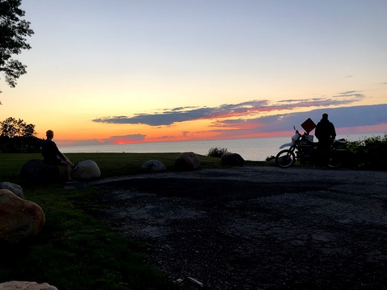 |
|--------------------------------------------------|
| Original Colored Image                           |
| 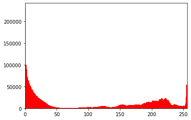  |
| Histogram of the Original Colored Image          |

I used **cv2.equalizeHist()** from **OpenCV** library for histogram
equalization. This function converts its input, a grayscale image, to its
Histogram equalized image. For colored images, we should separate red, blue, and
green layers, apply the function on each of them, and merge them back (see the
figures below).

The original and histogram-equalized images are shown below.

| 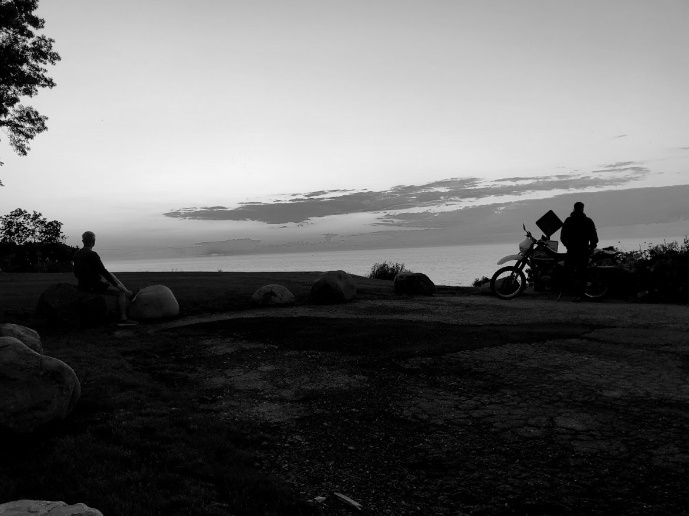 | 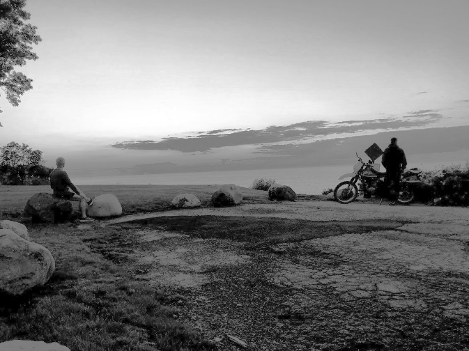 |
|--------------------------------------------------|--------------------------------------------------|
| Original Gray Image                              | Equalized Histogram Image                        |

We have the following results if we repeat the experiment for three different
types (extreme dark, medium-dark, and extreme light) of input grayscale images.

| 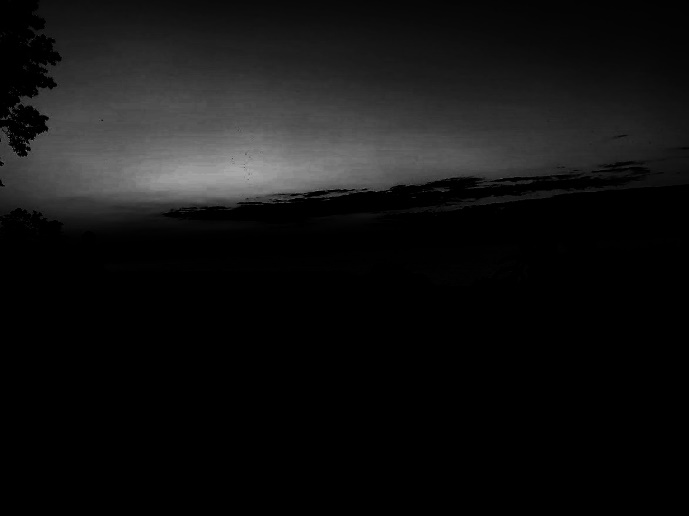 | 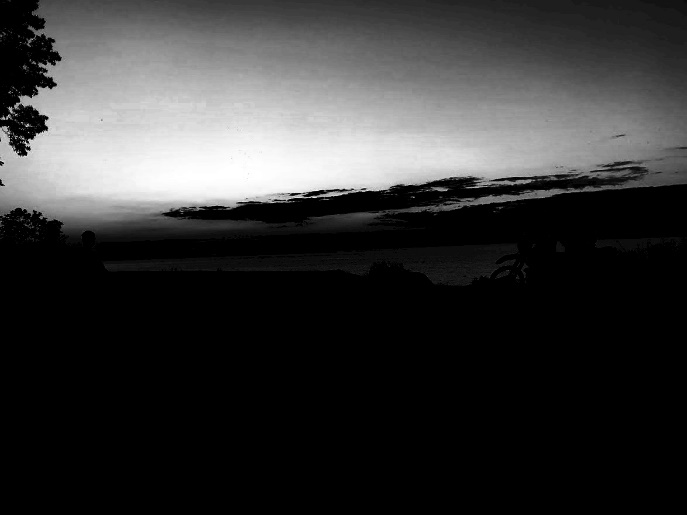 |
|--------------------------------------------------|--------------------------------------------------|
| Gray - extreme dark                              | Equalized Histogram – extreme dark               |
| 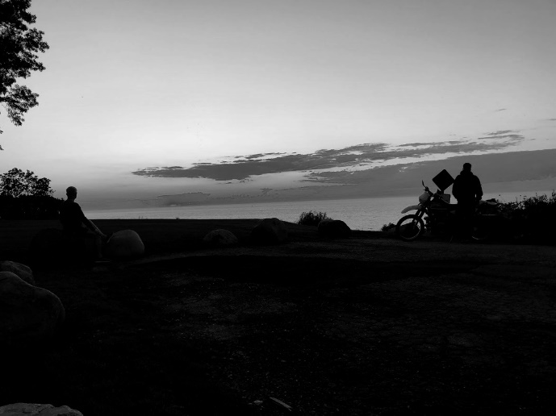 | 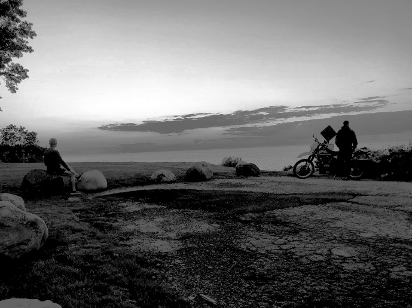 |
| Gray – medium dark                               | Equalized Histogram - medium dark                |
| 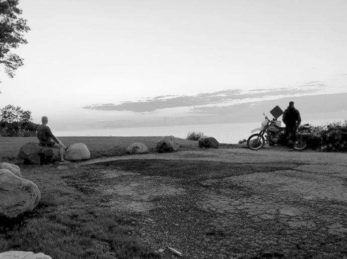 |  |
| Gray – extreme light                             | Equalized Histogram - extreme ligth              |

**Histogram equalization on a color image**

For the colored image, the original and histogram-equalized images are as
follows.

|  | 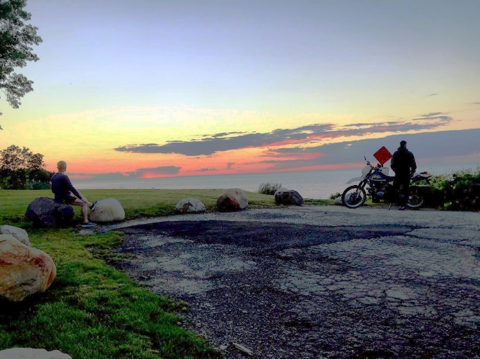 |
|--------------------------------------------------|--------------------------------------------------|
| Original Colored Image                           | Equalized Histogram Image                        |

Three different types (extreme dark, medium-dark, and extreme light) of input
color images are as follows.

| 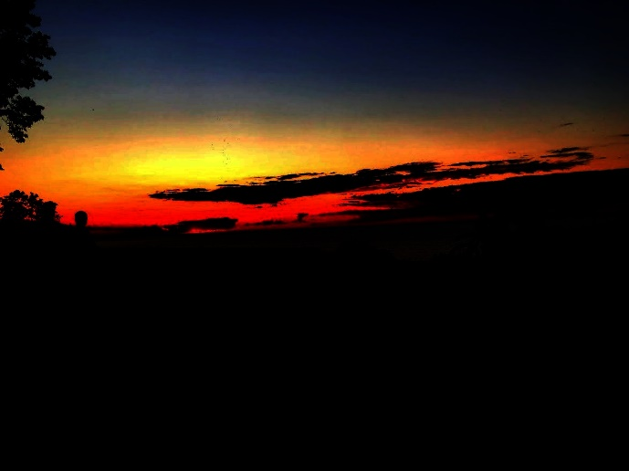 | 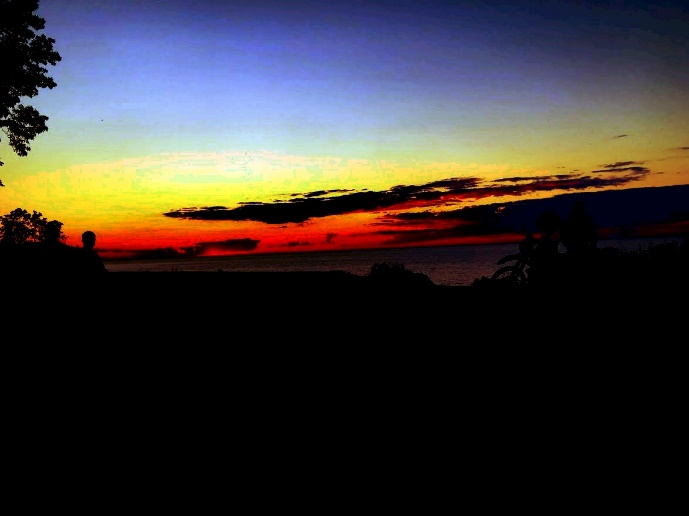 |
|--------------------------------------------------|--------------------------------------------------|
| Gray - extreme dark                              | Equalized Histogram – extreme dark               |
| 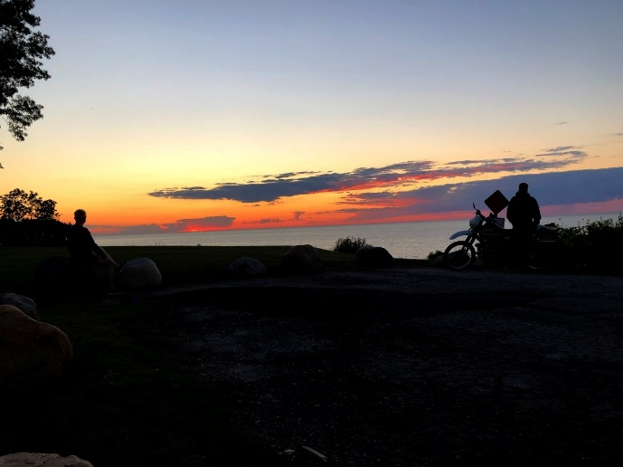 | 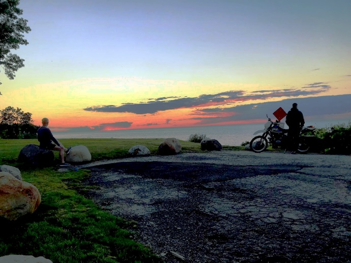 |
| Gray – medium dark                               | Equalized Histogram - medium dark                |
| 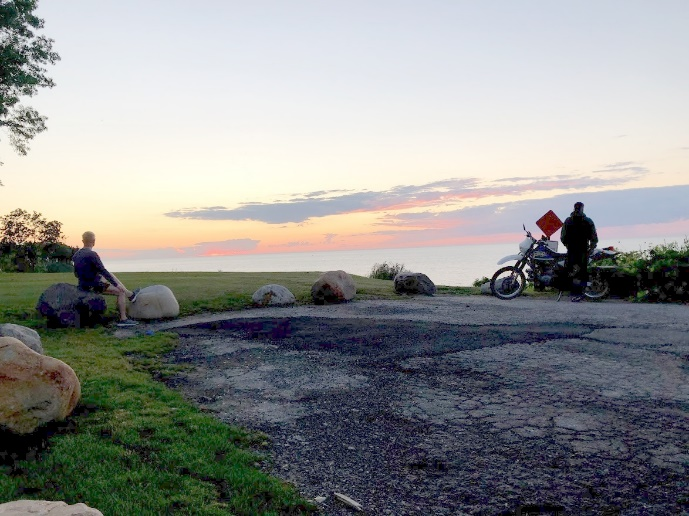 |  |
| Gray – extreme light                             | Equalized Histogram - extreme ligth              |

As the figures above show, histogram equalization approximates the value of each
pixel to the mean of all the pixels. So, it will increase the brightness of dark
images and decreases the brightness of extreme bright images.

**Image gradients of a grayscale image**

Image gradient is a directional change in image intensity. Using image gradient,
we can detect edges in images. To compute the gradient of an image, first, we
need to swipe the image in x (from left to right) and y (from top to bottom)
directions and mark the points where image intensity is changing drastically. In
this way, the edges of the image will be highlighted in x and y directions (Gx
and Gy). Then, we can calculate the gradient magnitude and direction by
following formulas:

G and θ are only for a small 3x3 area of the whole image. So, we need to repeat
the entire process for the entire image. To this end, we can use predefined
kernels, like Sobel kernels, and calculate the convolution of them with all 3x3
areas of the image. Sobel kernels which are two separate 3x3 matrices for x and
y direction, give more weightage to center pixels in comparison to other pixels.

I used **cv2.Sobel** function from **OpenCV** library. This function uses Sobel
kernels and repeats the convolution process by sliding kernels from left to
right and top to bottom.

-   Original, gradient in the x-direction, gradient in the y-direction, and
    gradient magnitude images.

|  | 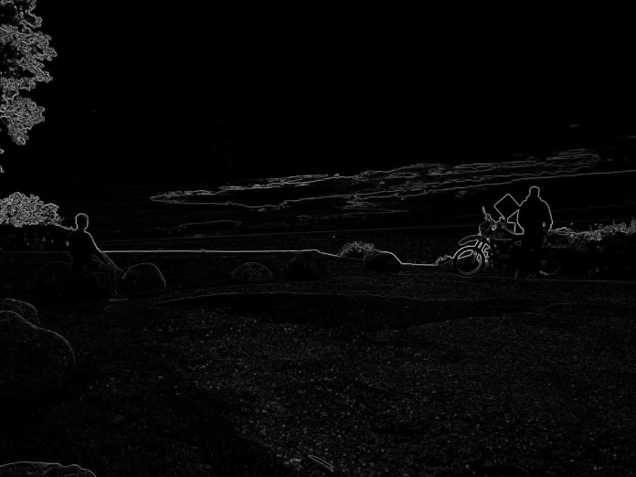 |
|--------------------------------------------------|--------------------------------------------------|
| Original Gray Image                              | gradient magnitude                               |
| 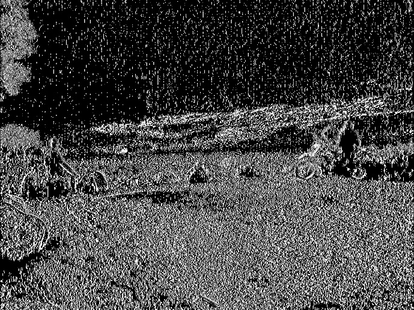 | 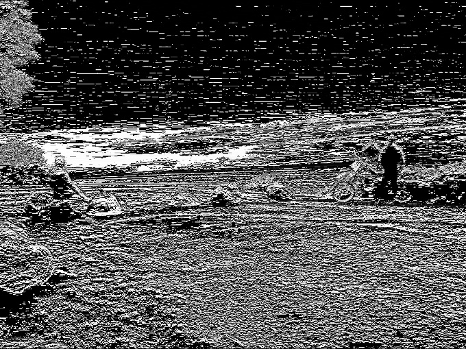 |
| the gradient in the x-direction                  | the gradient in the y-direction                  |

Edge detection has many applications in different areas like finger-print
matching, medical diagnosis, and license plate detection.

In the figures above, we can see vertical and horizontal lines in the x-gradient
and y-gradient images. These lines show the significant change in the image
intensity.

-   Let’s apply a simple threshold to the gradient magnitude image and display
    the gradient magnitude and the thresholding image. You can use 100 as your
    threshold value or any other appropriate value. Here I used 25, 50, 100, and
    150 as the threshold value.

| 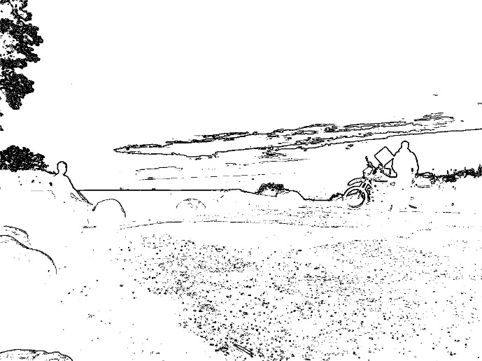 | 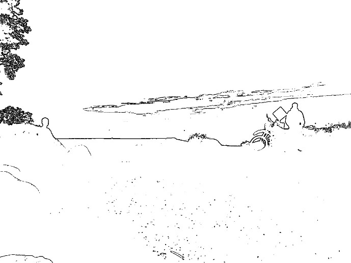 |
|--------------------------------------------------|--------------------------------------------------|
| gradient magnitude threshold **25**              | gradient magnitude threshold **50**              |
| 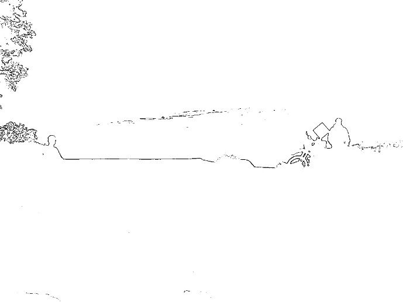 | 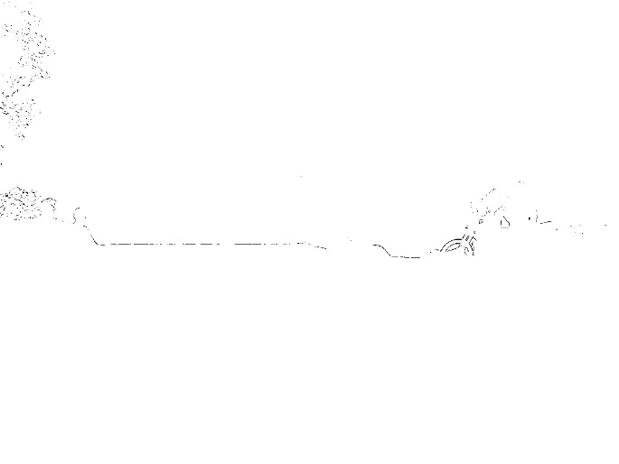 |
| gradient magnitude threshold **100**             | gradient magnitude threshold **150**             |

As we can see in the figures above, by masking values of gradient magnitude
below (or above) a threshold, we can detect desired things more efficiently;
like persons, vehicles, traffic signs, ….

To conclude, using histogram equalization, we can improve the lighting of low
contrast image. Also, by image gradient, we can detect the edges in the image.
So, it helps us to detect things in the image.

**References:**

<https://towardsdatascience.com/histogram-equalization-a-simple-way-to-improve-the-contrast-of-your-image-bcd66596d815>

<https://evergreenllc2020.medium.com/fundamentals-of-image-gradients-and-edge-detection-b093662ade1b>

<https://stackoverflow.com/questions/49732726/how-to-compute-the-gradients-of-image-using-python>

<https://codereview.stackexchange.com/questions/192292/threshold-an-image-for-a-given-range-and-sobel-kernel>

